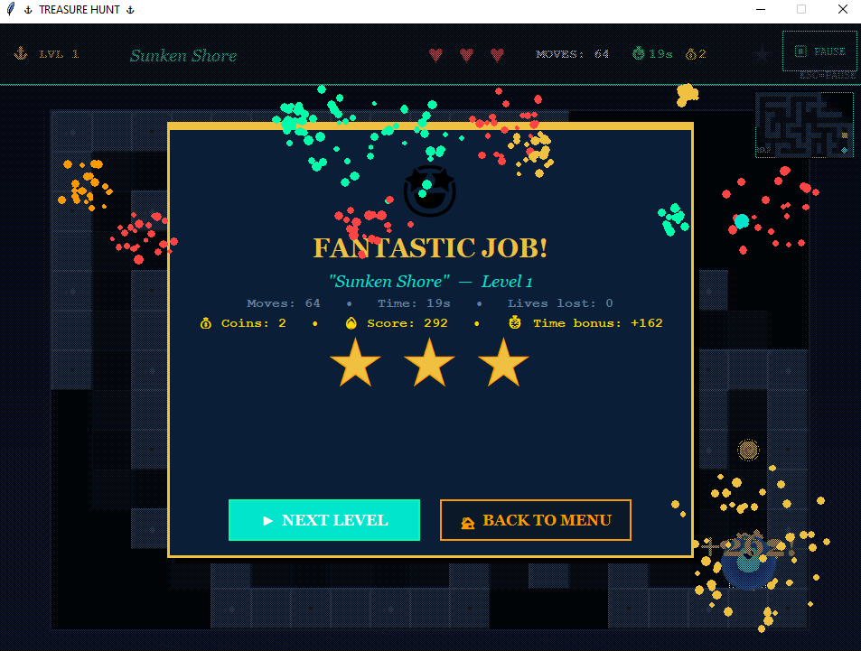
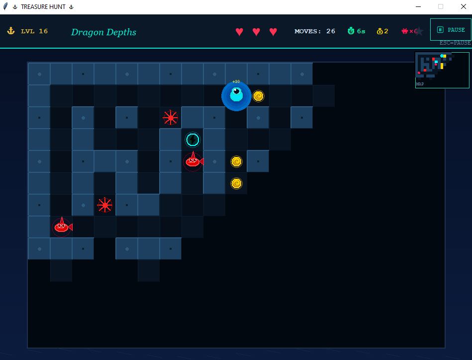
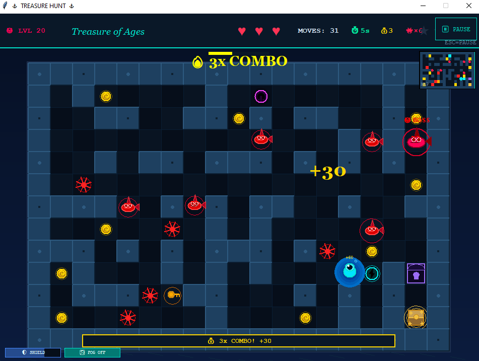
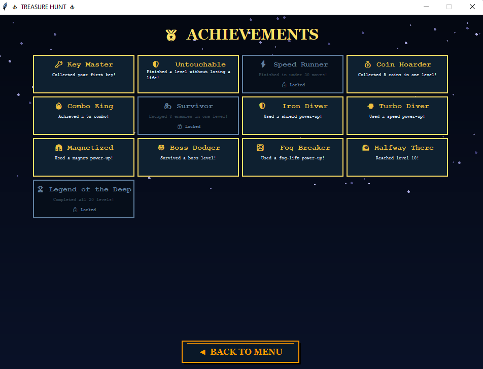
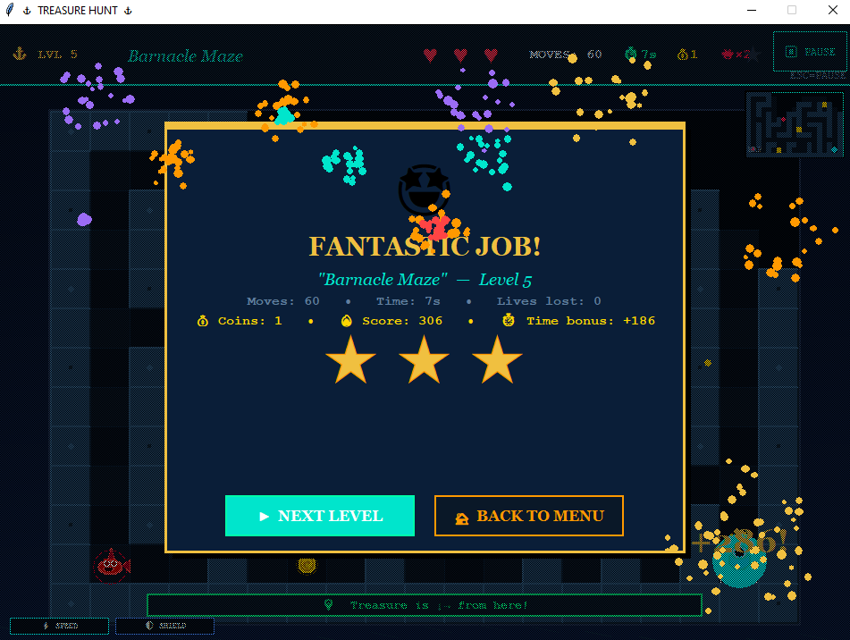

# 🏴‍☠️ Treasure Hunt Game


An advanced **GUI-based Treasure Hunt adventure game** developed using **Python** and **Tkinter**. Explore procedurally generated mazes, collect coins and power-ups, avoid intelligent enemies, unlock achievements, and complete 20 exciting levels in a fun and interactive gaming experience.

---

## 🎮 Gameplay Preview


---

## 🌟 Key Features

- 🗺️ 20 Challenging Levels
- 🌀 Procedurally Generated Mazes
- 👾 Intelligent Enemy AI
- ❤️ Lives System
- ⭐ Three-Star Rating System
- 💰 Coin Collection & Score Tracking
- ⚡ Power-Ups
- 🌫️ Fog of War
- 🧭 Mini Map
- 🏆 Achievement System
- 💾 Save & Load Progress
- 🔥 Combo Score System
- 👑 Boss Battles
- ⏱️ Timer Bonus
- ✨ Smooth Animations
- 🎉 Victory & Game Over Screens
- 🎨 Modern Graphical User Interface

---

## 🛠️ Technologies Used

- Python 3
- Tkinter
- JSON
- Object-Oriented Programming (OOP)

---

## 📸 Screenshots

### 🏠 Main Menu


### 🎮 Gameplay


### 👑 Boss Battle


### 🏆 Achievement System


### 🎉 Victory Screen


---

## 🚀 Installation

### Clone the repository

```bash
git clone https://github.com/syedashifa62-lan/Treasure-Hunt-Game.git
```

### Open the project folder

```bash
cd Treasure-Hunt-Game
```

### Run the game

```bash
python main.py
```

---

## 🎯 Gameplay

Your mission is to navigate through challenging mazes, collect treasures, avoid enemies, and complete all 20 levels. Earn stars based on your performance, unlock achievements, use power-ups strategically, and aim for the highest possible score.

---

## 💾 Save System

The game automatically saves your progress, allowing you to continue your adventure from where you left off.

---

## 📂 Project Structure

```text
Treasure-Hunt-Game
│
├── main.py
├── README.md
├── requirements.txt
├── .gitignore
├── LICENSE
│
└── screenshots/
    ├── gameplay.gif
    ├── menu.png
    ├── gameplay.png
    ├── boss-level.png
    ├── achievements.png
    └── victory.png
```

---

## 🔮 Future Enhancements

- 🔊 Background Music
- 🎵 Sound Effects
- 🎭 Character Selection
- 🌍 Additional Levels
- 👹 More Enemy Types
- 🎮 Difficulty Modes
- 🌐 Multiplayer Support
- 🏅 Online Leaderboard

---

## 👩‍💻 Developer

**Syeda Shifa Mahjabeen**

This project was created to strengthen my skills in Python programming, GUI development, game logic, object-oriented programming, and problem-solving while building an engaging desktop adventure game.

---

## ⭐ Support

If you enjoyed this project, please consider giving it a **⭐ Star** on GitHub.

It helps others discover the project and supports my work.

---

## 📜 License

This project is licensed under the **MIT License**.